# How to Use Our App

This guide provides a step-by-step walkthrough of our application's features.

### 1. Open Project in VS Code
Open VS Code and navigate to the project directory to begin.
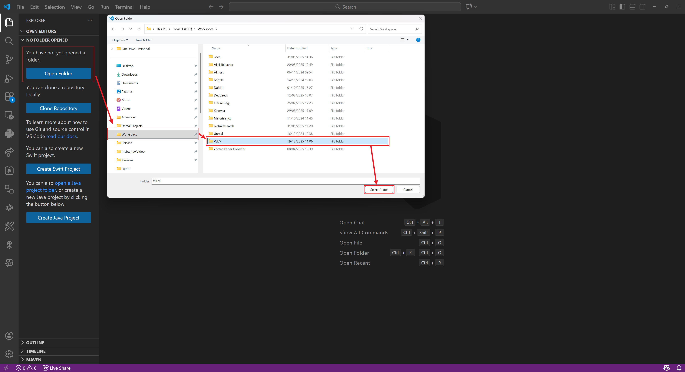

### 2. Run the Application
Select the main Python file `app.py`, choose the `vlmscope` conda environment in the bottom right, and click the run button in the top right to execute the script.
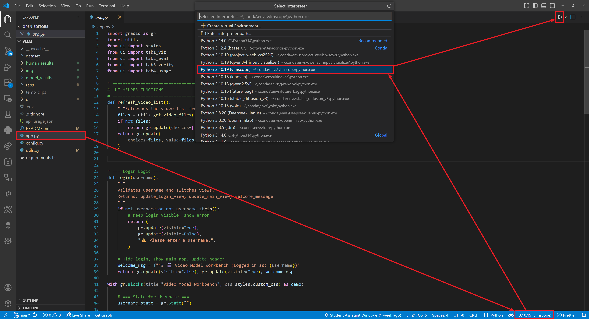

### 3. Access the Application
After running the script, a URL link will appear in the console. Copy this link to your browser or Ctrl + left-click it to open the application.
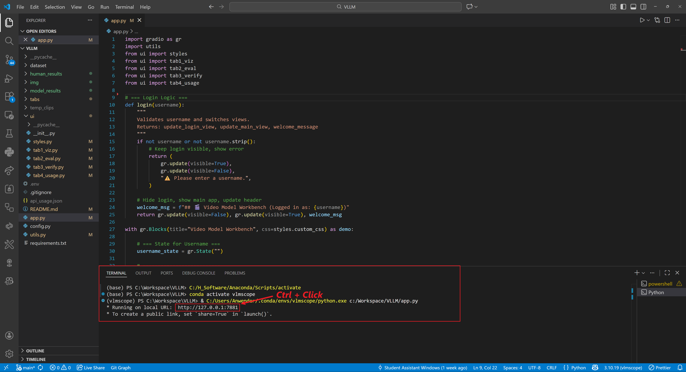

### 4. Log In to the Application
Enter your name as the username and click 'Login' to access the application.
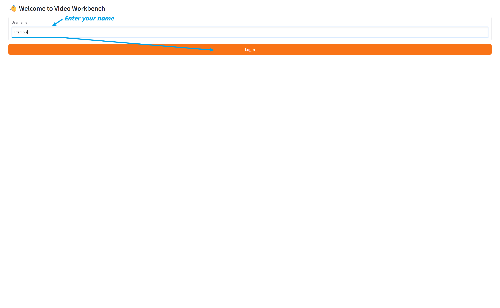

### 5. Navigate Through Tabs
The main interface features four tabs at the top for navigation. This image shows the application currently on the leftmost tab.
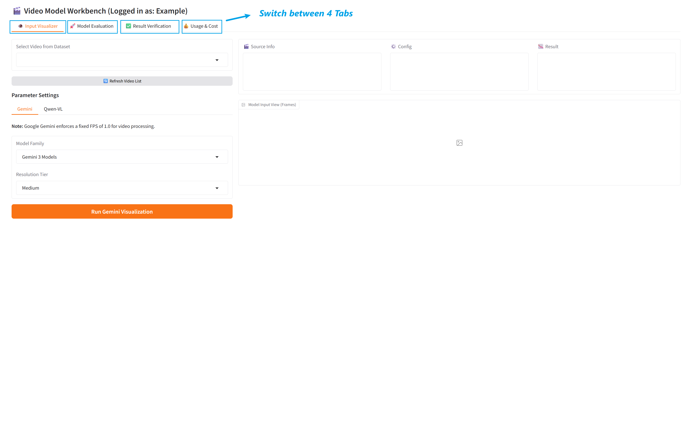

### 6. Visualizer Tab: Process Video Input
The 'Visualizer' tab allows you to see the video input as processed by the VLM. Select a video, click 'Run', and the processed video will be displayed frame by frame on the right side.
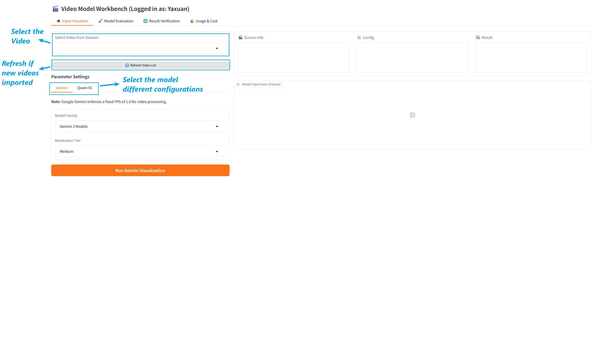

### 7. Example: Selecting a Video
This image illustrates an example where `demo2.mp4` has been selected as the video for analysis.
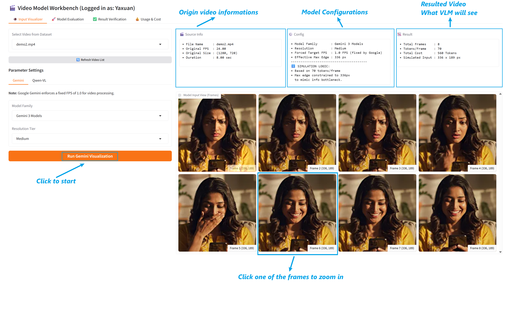

### 8. Frame-by-Frame Navigation
Click on any frame to zoom in for a detailed view. Use the left and right arrows next to the frame to navigate between frames.

### 9. Model Evaluation Tab: Run a Task
In the 'Model Evaluation' tab, enter a task name, select a model and its corresponding parameters. Input your prompt in the designated section (refer to examples).
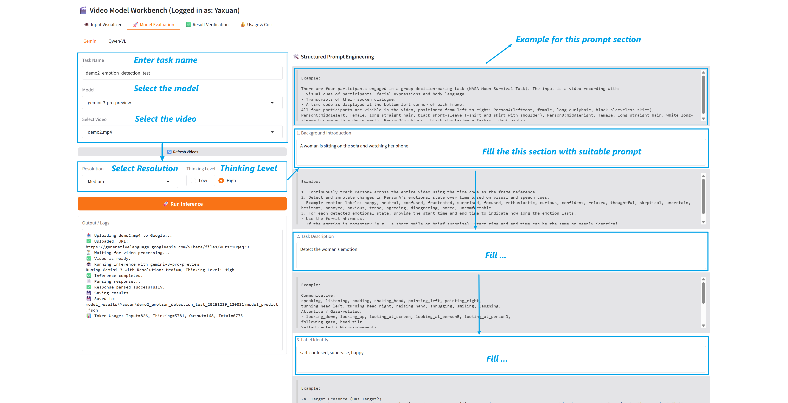

### 10. Prompt Input Guidelines
When filling out the prompt boxes, it is not necessary to complete every field, but at least one prompt box must be filled. Note that the prompts you provide will significantly influence the results.
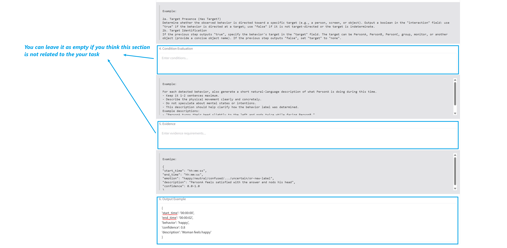

### 11. View Model Run Results
After entering all details, click 'Run'. The information box in the bottom left will then display the model's running steps and results.
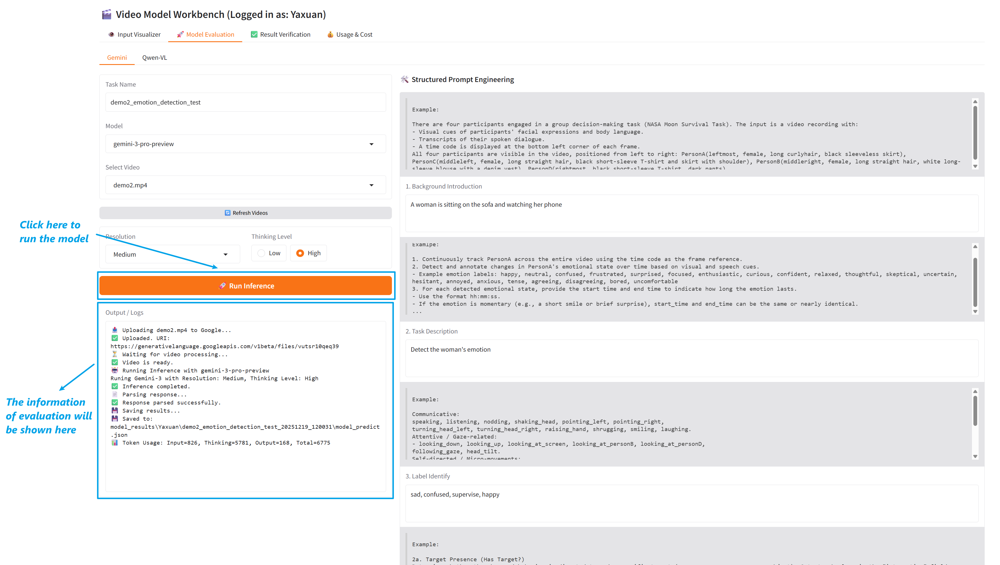

### 12. Result Verification Tab
In the 'Result Verification' tab, select the video and the corresponding model result. You can refresh the list to find the latest results, paying attention to the timestamps in the filenames. Alternatively, you can paste a JSON result directly.

Click 'Load Analysis'. On the left, you'll see the prompt used for the result. On the right, the video is segmented into clips based on the analysis.

For each clip, assign your own label and optionally leave a comment explaining your reasoning. Once you have finished verifying all clips, remember to save your work using the button in the bottom-left corner.

### 13. Monitor Token Usage and Cost
In this tab, you can review the token usage and estimated cost for different users.
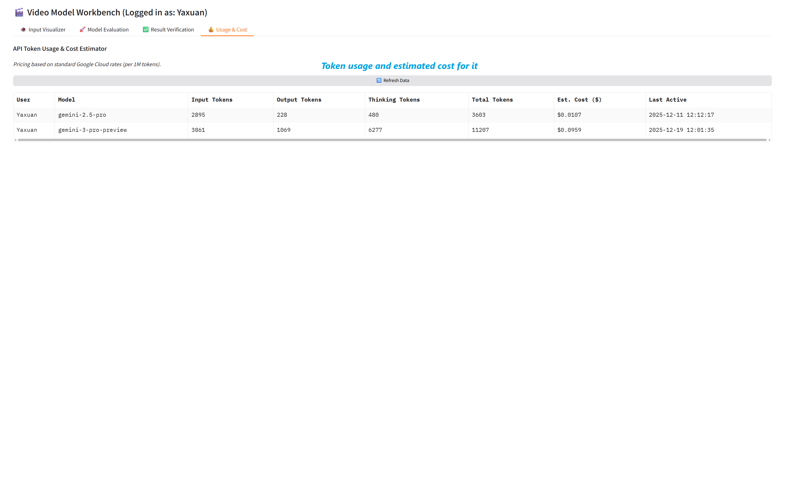
